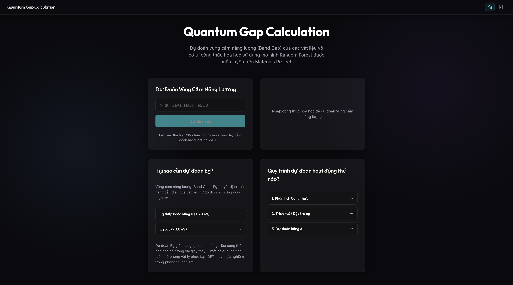

# ⚛️ Quantum Gap: Band Gap Prediction Dashboard


> A modern, glassmorphic web application for predicting the band gap energy of materials based on their chemical formulas using machine learning.

<br/>

<div align="center">
  
</div>

<br/>

## 📋 Table of Contents
- [About the Project](#-about-the-project)
- [Features](#-features)
- [Tech Stack](#-tech-stack)
- [Directory Structure](#-directory-structure)
- [Getting Started](#-getting-started)
- [Usage](#-usage)
- [Project Architecture](#-project-architecture--how-it-works)
- [License](#-license)

---

## 📖 About the Project

**Quantum Gap** is an educational and predictive tool designed for materials science. It predicts whether a material possesses a **High** or **Low** band gap energy (_Vùng cấm năng lượng_) directly from its chemical formula. 

Powered by a Random Forest machine learning model trained on Materials Project data, this application serves as both a predictive utility and an educational platform, fully localized in Vietnamese.

---

## ✨ Features

- **🎯 Accurate Predictions**: Instantly classify the band gap (High/Low) from a chemical formula.
- **📚 Educational Insights**: Detailed scientific explanations on the physical implications of different band gaps.
- **⚙️ Simulation Process**: Step-by-step visual demonstration of the calculation and featurization process.
- **🕒 Prediction History**: A sleek history table to quickly reference recent predictions.
- **🎨 Modern UI/UX**: Clean, responsive, and professional glassmorphic design.
- **🌐 Localization**: Fully translated interface and scientific terminology for Vietnamese users.

---

## 🛠 Tech Stack

### Frontend
-  **React 18**
-  **TypeScript**
-  **Vite**
-  **Vanilla CSS** (Glassmorphism design)

### Backend
-  **FastAPI** (Python)
-  **Uvicorn** (ASGI server)

### Machine Learning
-  **scikit-learn**: Random Forest classification model
-  **pymatgen & matminer**: Chemical formula parsing and Magpie descriptor featurization

---

## 📂 Directory Structure

```text
.
├── backend/                # FastAPI server and ML pipeline
│   ├── main.py             # API endpoints
│   └── models/             # Contains the trained rf_model.joblib
├── frontend/               # React Vite application
│   ├── src/                # Components, CSS, and application logic
│   └── index.html          # Entry point
└── data/                   # Datasets and SQLite DB
```

---

## 🚀 Getting Started

Follow these instructions to set up the project locally.

### Prerequisites

Ensure you have the following installed on your machine:
- [Node.js](https://nodejs.org/) (v18 or higher)
- [Python](https://www.python.org/) 3.9+
- pip (Python package installer)

### Installation

#### 1. Backend Setup

Open a terminal, navigate to the project root, and then to the `backend` directory:

```bash
cd backend

# Create a virtual environment (recommended)
python -m venv venv
source venv/bin/activate  # On Windows: venv\Scripts\activate

# Install dependencies
pip install fastapi uvicorn scikit-learn pymatgen matminer joblib
```

#### 2. Frontend Setup

Open a new terminal session, navigate to the `frontend` directory:

```bash
cd frontend

# Install NPM packages
npm install
```

---

## 💻 Usage

To run the application locally, start both the backend and frontend servers simultaneously.

### Start the Backend Server

```bash
cd backend
source venv/bin/activate  # Ensure your virtual env is active
uvicorn main:app --reload
```
_The API will be available at `http://localhost:8000`._

### Start the Frontend Server

```bash
cd frontend
npm run dev
```
_The frontend application will be available at the local URL provided by Vite (usually `http://localhost:5173`)._

---

## 🧠 Project Architecture & How it Works

1. **User Input**: The user enters a chemical formula (e.g., `NaCl`, `SiO2`) into the React interface.
2. **API Request**: The frontend transmits the formula to the FastAPI backend via a POST request.
3. **Featurization**: 
   - The backend utilizes `pymatgen` to parse the chemical composition.
   - It then uses `matminer` to extract Magpie descriptors (elemental properties based on the formula).
4. **Prediction**: The extracted features are fed into a pre-trained `scikit-learn` Random Forest model, classifying the band gap as "High" or "Low".
5. **Response & Visualization**: The result is returned to the frontend and displayed with step-by-step loading animations, followed by scientific insights.

---

## 📄 License

Distributed under the MIT License. See `LICENSE` for more information.
